##  SampattiPrabha - Real Estate  (MERN + Prisma + Socket.io)

A **production-ready real estate web platform** built using the MERN stack. This full-featured application enables users to list, discover, and chat about properties in real-time. It uses **Prisma** for database abstraction, **JWT + Cookies** for secure authentication, and **Socket.io** for live messaging—offering a seamless and interactive experience.

---

###  **Key Features**

*  **Responsive Frontend**
  Developed with **React.js** and styled using **CSS**, the UI is responsive and mobile-friendly. **Context API** and **Zustand** manage global state seamlessly.

*  **Backend Architecture**
  The backend uses **Node.js** and **Express.js** with **Prisma ORM** to handle MongoDB operations with type safety and schema consistency.

*  **Authentication & Authorization**
  User sessions are managed using **JWTs** and **HTTP-only Cookies**, with protected routes for authenticated access.

*  **Real-Time Messaging**
  Implemented **Socket.io** for instant communication between buyers and sellers, complete with typing indicators and auto-scroll via `useRef`.

*  **Client-Side Routing**
  **React Router DOM** enables intuitive navigation, including **protected routes** for private pages.

*  **Property Listings CRUD**
  Users can **Create, Read, Update, and Delete** property listings with image uploads and metadata.

*  **Image Upload Support**
  Integrated with **Cloudinary** (or similar service) for efficient property image handling.

*  **Interactive Maps**
  **React Leaflet** shows property locations on maps to boost user experience.

---

###  **Tech Stack**

* **Frontend:** React.js, CSS, Context API, Zustand, React Router DOM
* **Backend:** Node.js, Express.js, Prisma ORM
* **Database:** MongoDB (via Prisma adapter)
* **Authentication:** JWT + HTTP-only Cookies
* **Real-Time:** Socket.io
* **File Handling:** Cloudinary (for image uploads)
* **Maps:** React Leaflet
* **Utilities:** useRef, axios, bcrypt, dotenv

---

### 📌 Why This Project Stands Out

* Combines **modern full-stack practices** with real-time features
* Showcases secure session handling using JWT + cookies
* Demonstrates clean architectural separation of frontend/backend
* Implements production-grade real estate workflows
<!-- * Highly scalable and extensible for future features (e.g., payments, saved listings, admin panel) -->

---

<!-- ###  Possible Add-Ons / Future Enhancements

* Admin dashboard for managing users and listings
* Full-text search with MongoDB Atlas or Algolia
* Stripe integration for paid promotions or premium listings
* Advanced filtering/sorting by price, location, and features
* Notifications using WebSockets or Push API -->


<!-- ------------------------------------ -->

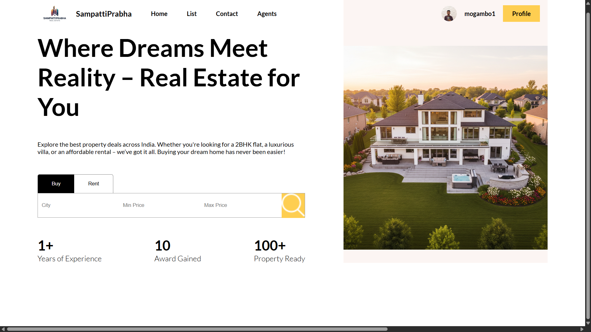
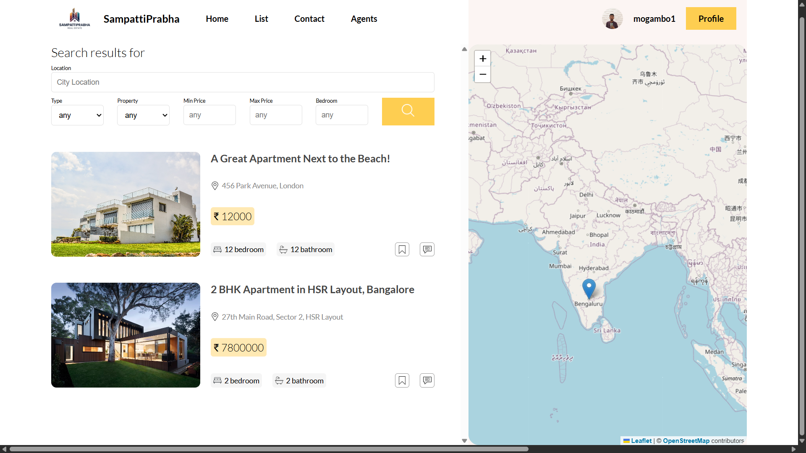
<!-- 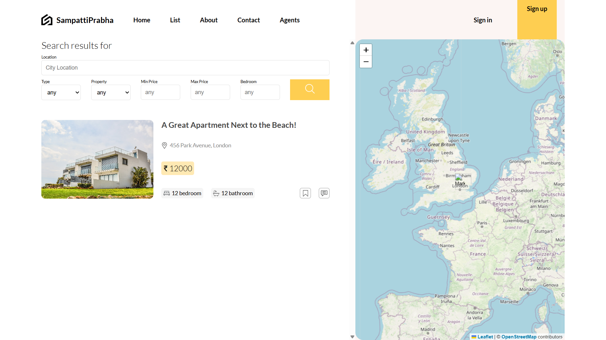 -->
<!-- 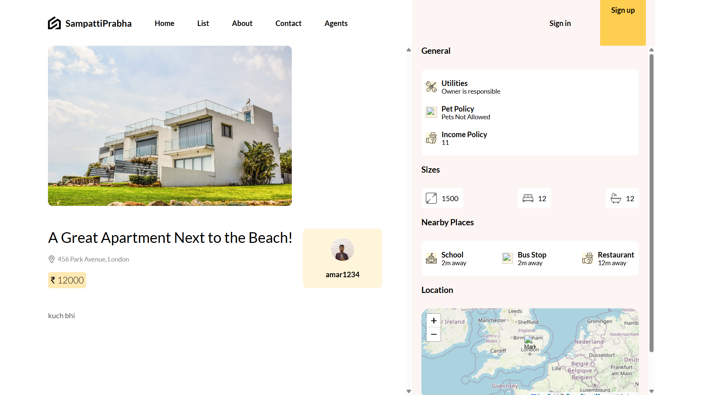 -->
<!--  -->
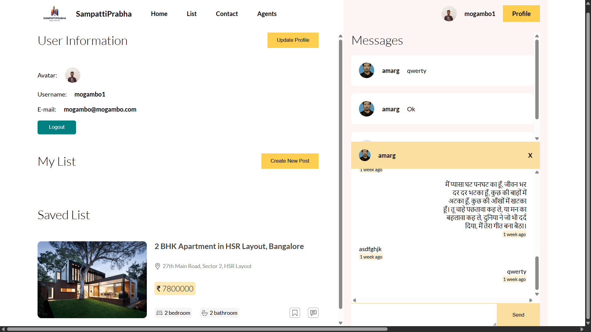
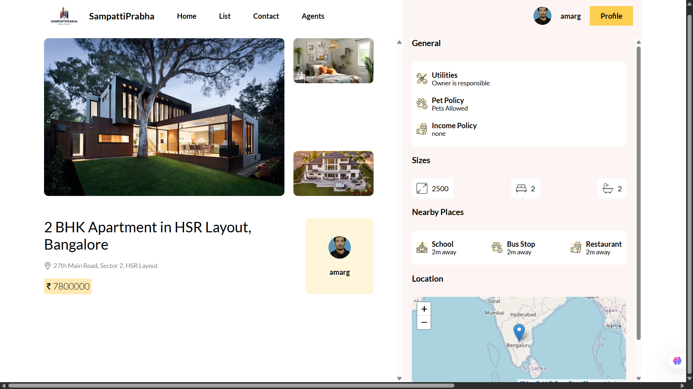
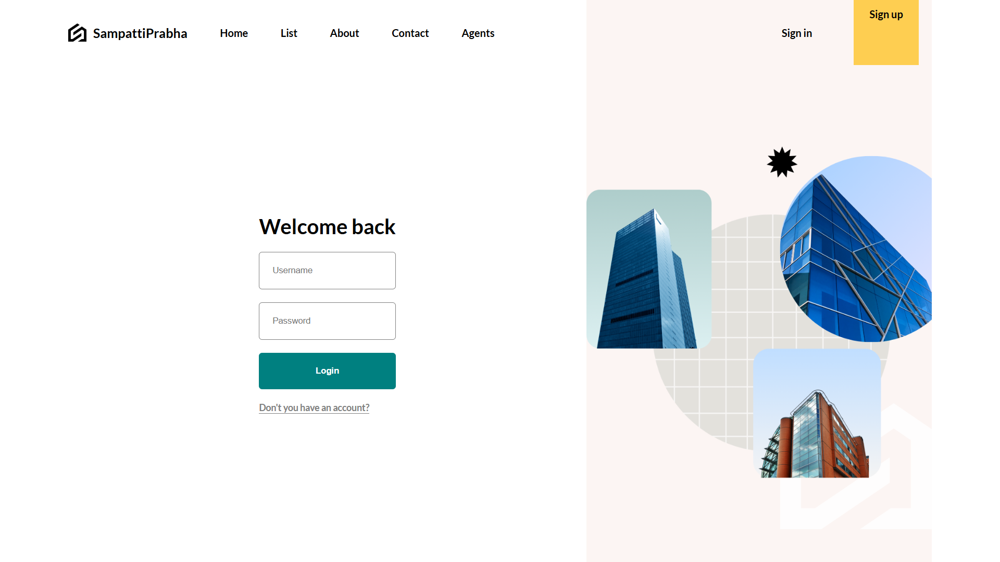
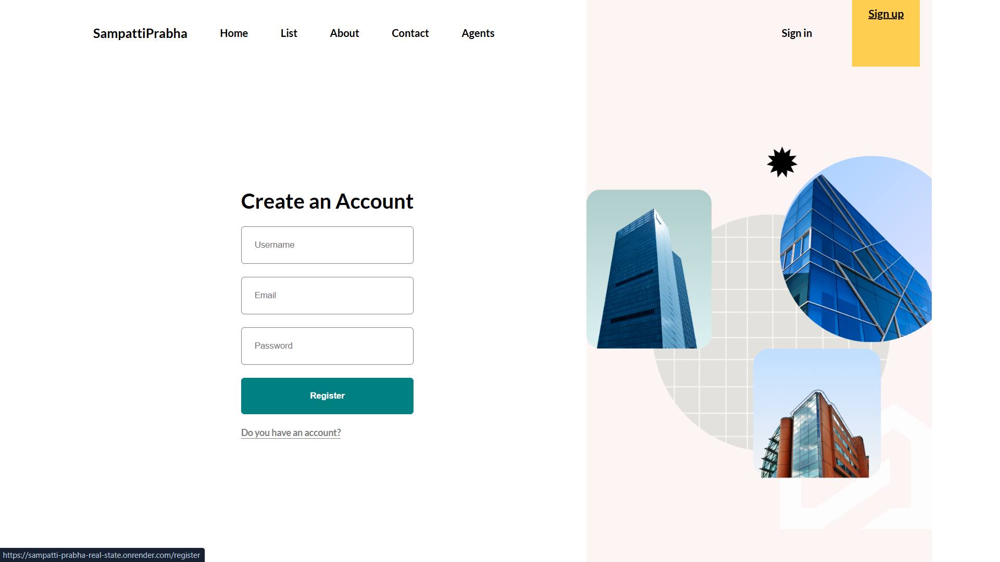
<!-- 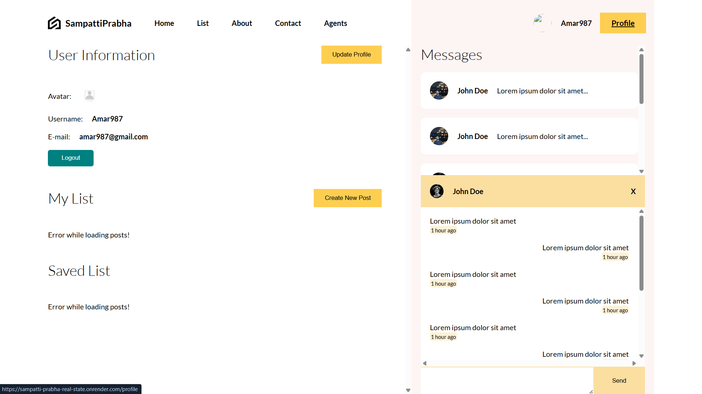 -->
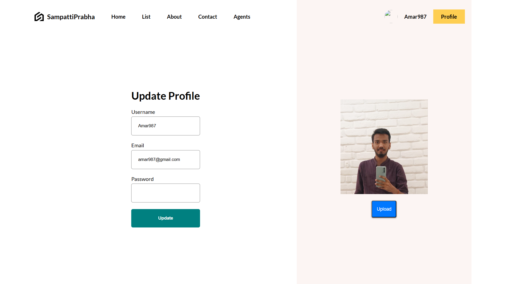
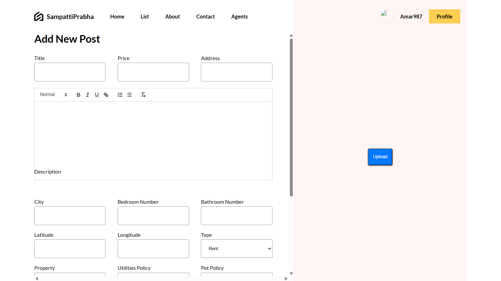
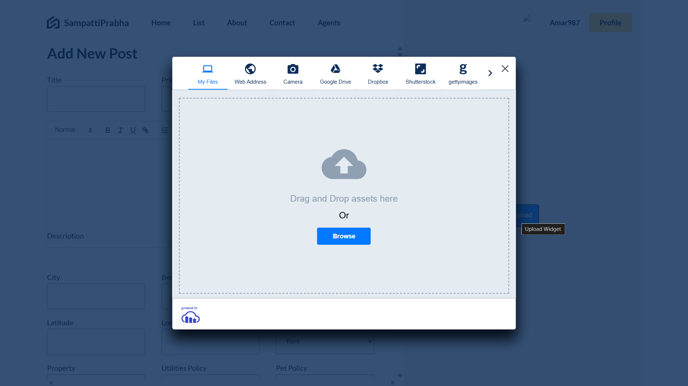
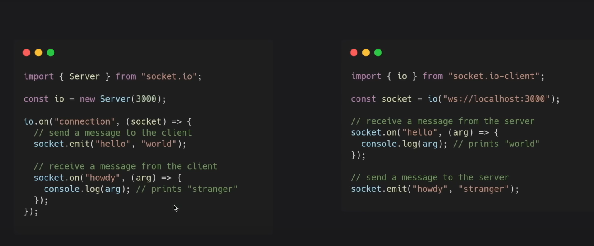
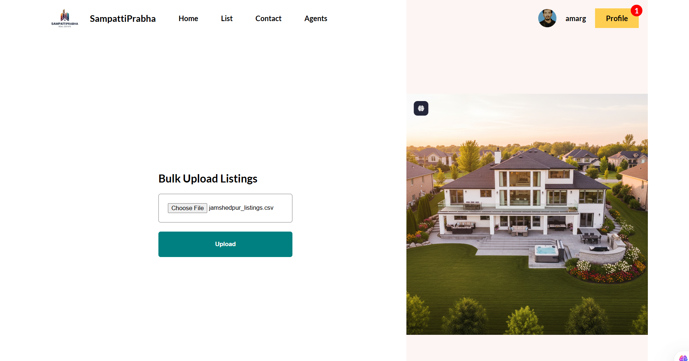
<!-- update post -->
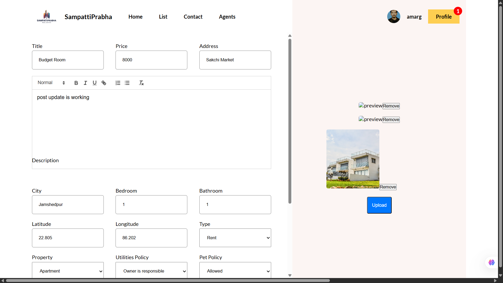


<!-- 
# RealState Thunder Client Collection

## Overview

This repository contains a **Thunder Client Collection** for the **RealState** project, which includes various API requests related to authentication, user management, and post handling. The collection is designed to facilitate testing and interaction with the backend of the RealState system, which is built around user authentication, data management, and secure access to protected routes.


## API Requests

### Authentication APIs

1. **Register User** (`POST`)
   - **URL**: `http://localhost:8000/api/auth/register`
   - **Description**: Registers a new user.
   - **Header**:
   Content-Type: application/json
   - **Body**:
     ```json
     {
       "username": "wolf",
       "email": "wolf@wolf.com",
       "password": "wolf"
     }
     ```

2. **Login** (`POST`)
   - **URL**: `http://localhost:8000/api/auth/login`
   - **Description**: Logs in a user.
   - **Body**:
     ```json
     {
       "username": "wolf",
       "password": "wolf"
     }
     ```

3. **Logout** (`POST`)
   - **URL**: `http://localhost:8000/api/auth/logout`
   - **Description**: Logs out the user.
   - **Headers**:
     - Cookie: `<JWT_TOKEN>`

### User APIs

4. **Get All Users** (`GET`)
   - **URL**: `http://localhost:8000/api/users/`
   - **Description**: Retrieves a list of all users.

5. **Get Single User** (`GET`)
   - **URL**: `http://localhost:8000/api/users/:userId`
   - **Description**: Retrieves details for a single user.
   - Example: `http://localhost:8000/api/users/66c32a7094cc344f2351361d`

6. **Update User** (`PUT`)
   - **URL**: `http://localhost:8000/api/users/:userId`
   - **Description**: Updates a user's details.
   - **Body**:
     ```json
     {
       "username": "mogambo",
       "email": "mogambo@wolf.com",
       "password": "mogambo"
     }
     ```

7. **Delete User** (`GET`)
   - **URL**: `http://localhost:8000/api/users/:userId`
   - **Description**: Deletes a user from the database.

### Protected Routes

8. **Test Protected Route** (`GET`)
   - **URL**: `http://localhost:8000/api/test/should-be-logged-in`
   - **Description**: Tests access to a route requiring user authentication.
   - **Headers**:
     - Cookie: `<JWT_TOKEN>`

9. **Test Admin Route** (`GET`)
   - **URL**: `http://localhost:8000/api/test/should-be-Admin`
   - **Description**: Tests access to a route restricted to admins.
   - **Headers**:
     - Cookie: `<JWT_TOKEN>`

### Post APIs

10. **Get All Posts** (`GET`)
    - **URL**: `http://localhost:8000/api/posts`
    - **Description**: Retrieves a list of all posts.

11. **Get Single Post** (`GET`)
    - **URL**: `http://localhost:8000/api/post/:postId`
    - **Description**: Retrieves details of a single post.
    - Example: `http://localhost:8000/api/post/66f54be0ad86a5b568401617`

12. **Update Post** (`PUT`)
    - **URL**: `http://localhost:8000/api/post/:postId`
    - **Description**: Updates the details of an existing post.

## How to Use

1. **Import Collection**: Open Thunder Client and import the JSON collection by navigating to the "Collections" tab.
2. **Set Environment**: Make sure your backend server is running locally or update the `localhost` URLs to your deployed backend if applicable.
3. **Send Requests**: Use the different requests within the collection to interact with your backend and verify functionality. -->


## Contact

For any issues or questions related to this project, please reach out at amar8601082@gmail.com.